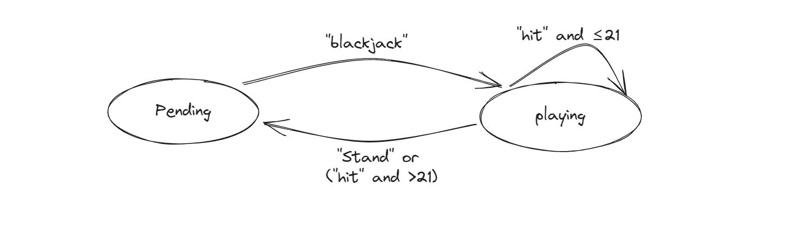

# Discord Bot for Blackjack

## Introduction

It is a Discord bot that can play blackjack game with you.

Thanks to the crate [store_flows], I can design & implement the state storage and transition of this game.  

[store_flows]: https://docs.flows.network/docs/integrations/platform-sdk-features/store

## How to play

You can invite it to your server by click this [link], and play with it by direct messaging.

[link]: https://discord.com/api/oauth2/authorize?client_id=1138746375639683122&permissions=0&scope=bot

- You can only interact with the bot with Direct Messages
- First, send "blackjack" to begin. Then you can see a introduction and the bot is in "playing" state.
- By sending "hit" or "stand", you can choose to take another card or not.
- After you "stand" or your point gose beyond 21, the game will stop. Now, the bot is in "pending" state

## Demonstration

After starting the game by sending "blackjack":

 

Choose to "hit" or "stand" during the game:

When you got a BLACKJACK (Card A and a face card (J, K, Q)):

When you win:

